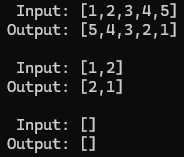

### LeetCode #206. Reverse Linked List
Given the head of a singly linked list, reverse the list, and return the reversed list.

(SinglyLinkedList was custom-made myself, ListNode was from the LeetCode problem)

---
### Example 1:


        Input: head = [1,2,3,4,5]
        Output: [5,4,3,2,1]
---
### Example 2:

    
        Input: head = [1,2]
        Output: [2,1]
---
### Example 3:
        ```
        Input: head = []
        Output: []
        ```
---
### Code Output:

